# Проект DLS 1 семестр осень 2020 image generation.

Суркис Антон (Stepik id: [83694640](https://stepik.org/users/83694640))

Мне удалось сделать только 1 пункт &mdash; повторить существующее решение
из [статьи о pix2pix](https://arxiv.org/pdf/1611.07004.pdf)
[пример из статьи](https://colab.research.google.com/github/tensorflow/docs/blob/master/site/en/tutorials/generative/pix2pix.ipynb#scrollTo=Kn-k8kTXuAlv)
с существующей архитектурой модели, но моей реализацией.
Придумать другую задачу и найти подходящие датасеты мне не удалось.

Из-за отсутствия собственных вычислительных мощностей повторял решение в Google Colab,
после этого портировал в отдельные Python-файлы,
но работоспособность самого тренировочного цикла проверить не на чем.

Скрипт для загрузки датасета: `bin/dataset_download.sh` (запускать из корневой директории проекта).

Весов после 300 эпох обучения: `bin/model_download_300.sh`.

Запуск самой сети: `python3 src/train.py`. 
Возможные аргументы:
- `-t`/`--train` &mdash; обучать нейросеть, а не использовать для вывода результатов;
- `-e`/`--epoch <количество эпох>` &mdash; задать количество эпох (также работает и при загрузке предобученных сетей, но нужно убедиться, что соответствующий слепок существует). По-умолчанию 300;
- `-d`/`--dataset <датасет>` &mdash; задать имя датасета. По умолчанию `facades`. Поиск файлов будет по пути `src/dataset/<датасет>/(test|train|val)/**.jpg`.

[Этот код в Google Colab](https://colab.research.google.com/drive/1oXobmdumJuvfxPpjZwfr2dyi84Gn0Ueg?usp=sharing)

История обучения сети: 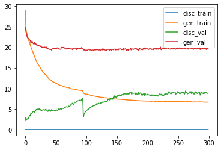

Как можно заметить, проблему переобучения дискриминатора решить не удалось,
поэтому генератор также будет переобучен.

Примеры результатов выполнения на валидационном датасете
(слева &mdash; разметка, по центру &mdash; реальное изображение,
справа &mdash; сгенерированный фасад):

10 эпох: 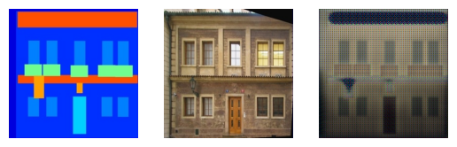

20 эпох: 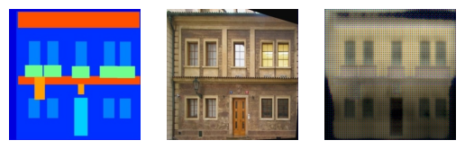

30 эпох: 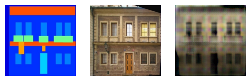

40 эпох: 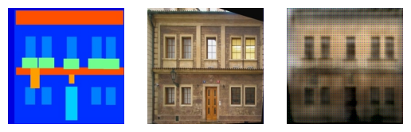

50 эпох: 

60 эпох: 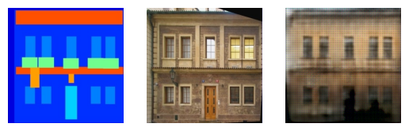

70 эпох: 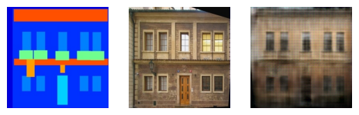

80 эпох: 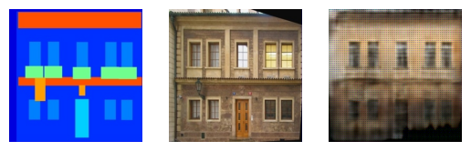

90 эпох: 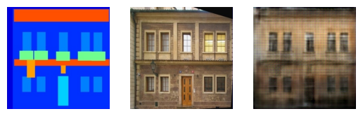

100 эпох: 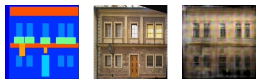

110 эпох: 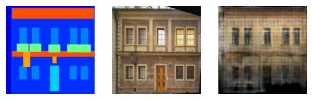

120 эпох: 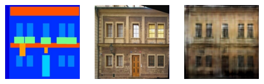

130 эпох: 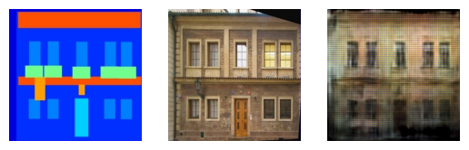

140 эпох: 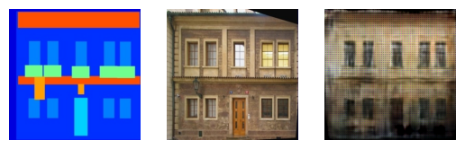

150 эпох: 

160 эпох: 

170 эпох: 

180 эпох: 

190 эпох: 

200 эпох: 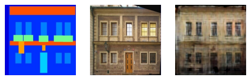

210 эпох: 

220 эпох: 

230 эпох: 

240 эпох: 

250 эпох: 

260 эпох: 

270 эпох: 

280 эпох: 

290 эпох: 

300 эпох: 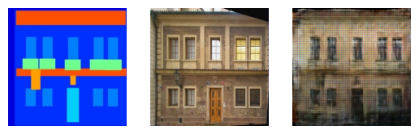
